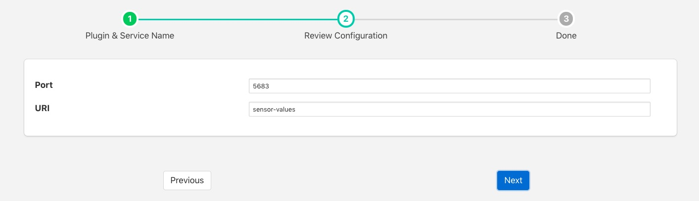

.. Images

CoAP
====

The *fledge-south-coap* plugin implements a passive CoAP listener that will accept data from sensors implementing the CoAP protocol. CoAP is an Internet application protocol for constrained devices to send data over the internet, it is similar to HTTP but may be run over UDP or TCP and is considerably simplified to allow implementation in small footprint devices. CoAP stands for Constrained Application Protocol.

The plugin listens for POST requests to the URI defined in the configuration. It expects the content of this PUT request to be a CBOR payload which it will expand and create assets for the items read from the CBOR payload.

To create a south service with the COAP plugin

  - Click on *South* in the left hand menu bar

  - Select *coap* from the plugin list

  - Name your service and click *Next*

  +----------+
  | |coap_1| |
  +----------+

  - Configure the plugin

    - **Port**: The port on which the COAP plugin will listen

    - **URI**: The URI the plugin expects to receive POST requests

  - Click *Next*

  - Enable the service and click on *Done*

